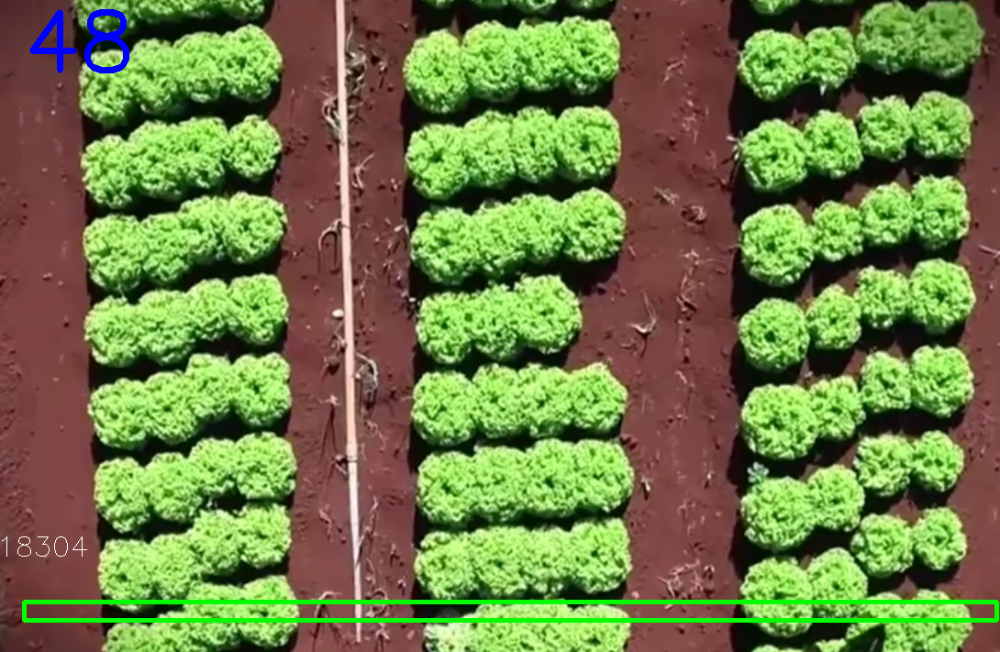

# Contando Alfaces com Python e OpenCV

Este é um projeto simples para contar a quantidade de alfaces em um vídeo usando a biblioteca OpenCV em Python.

## Pré-requisitos

- Python
- OpenCV

## Instalação

1. **Clone o repositório:**

   ```bash
   git clone https://github.com/jonathan953/Contando-Alfaces-Com-Python.git

2. Certifique-se de que você tenha Python e OpenCV instalados no seu sistema.

## Como Usar

1. Execute o script Python `Alface.py` para iniciar a contagem de alfaces.

2. Use a tecla "P" para pausar e retomar a contagem.

3. Use a tecla "Q" para encerrar o programa.

4. A quantidade de alfaces contadas será exibida na parte superior do vídeo.

5. A quantidade de alfaces contadas será armazenada no arquivo `quantidade_alfaces.txt` no mesmo diretório do código.

## Exemplo de Saída



## Contribuições

Contribuições são bem-vindas! Sinta-se à vontade para abrir problemas (issues) ou enviar solicitações de pull (pull requests) para melhorar este projeto.

## Licença

Este projeto é distribuído sob a licença [MIT](LICENSE).
